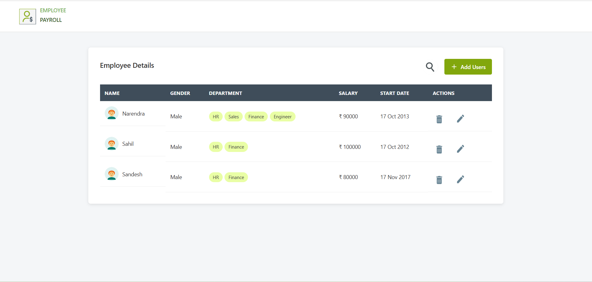
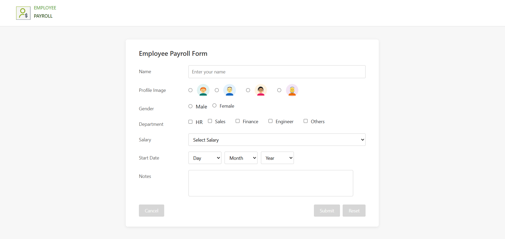

# Employee Payroll App

## 📌 Description
This is a web application to manage employee payroll details.

## 🚀 Features
- Add Employee
- Edit / Delete Employee
- Search Employee
- Responsive UI

## 🛠️ Tech Stack
- HTML
- CSS
- JavaScript
- jQuery
- JSON Server

## 📸 Screenshots

### 🏠 Home Page

### ➕ Add Employee

## ▶️ Run Project
1. Clone repo
2. Run JSON server:
   npm install -g json-server
   json-server --watch db.json
3. Open index.html

## 👨‍💻 Author
Narendra Singh